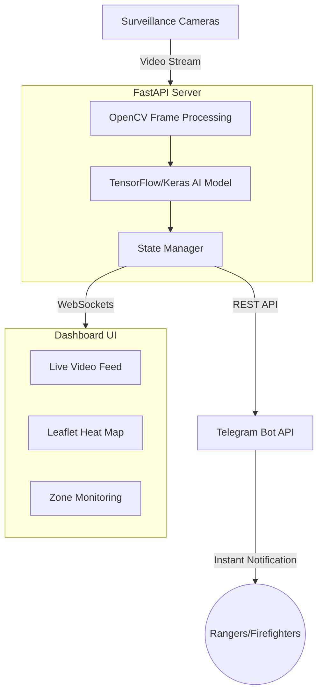
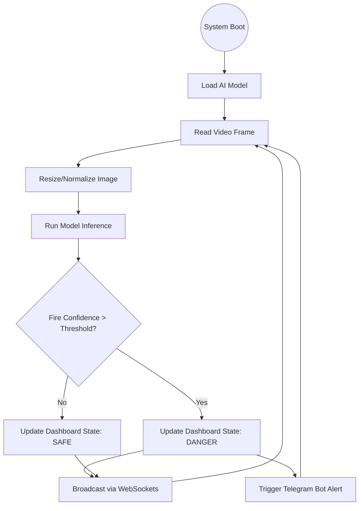
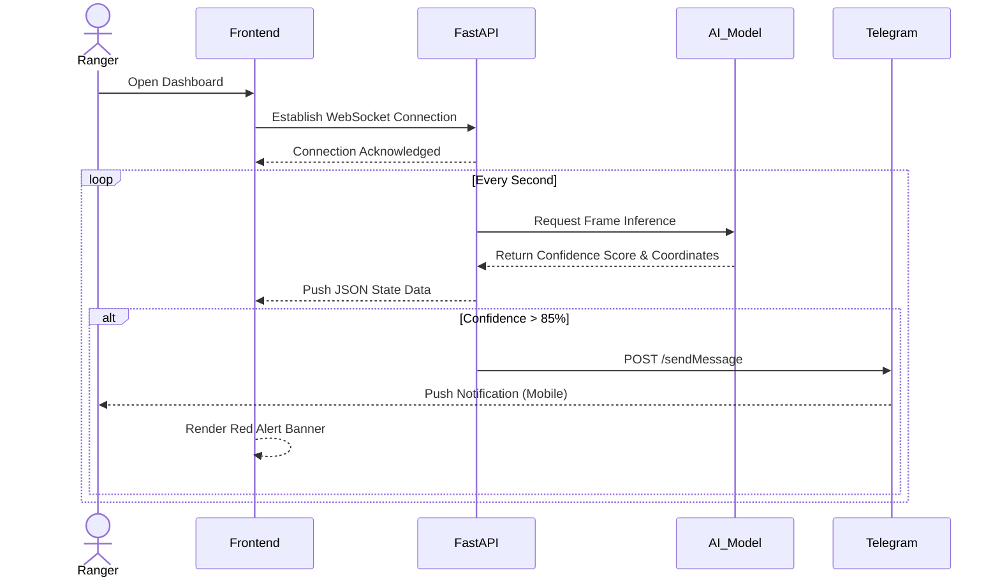
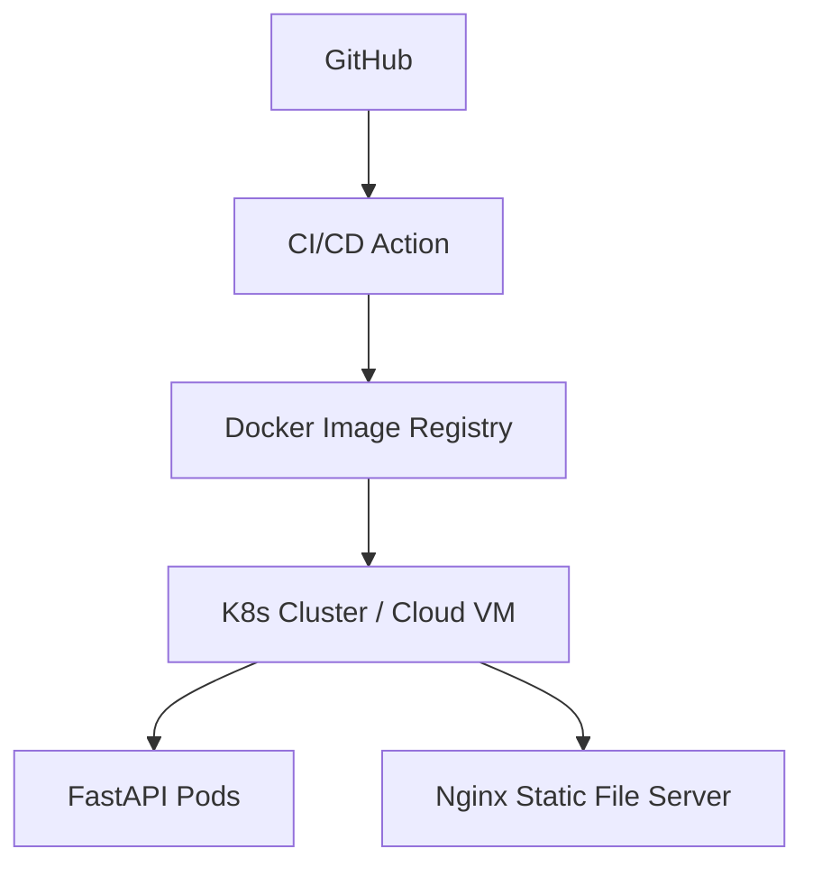

# 🔥 Smart Forest Fire Surveillance System

---

## 📖 Overview

### 🎯 Problem Statement
Forest fires cause devastating environmental, economic, and human losses every year. Traditional detection methods (satellite imagery, manual patrols) are often too slow, detecting fires only after they have grown significantly. Rapid response requires real-time, ground-level detection.

### 💡 Solution
An AI-powered, real-time surveillance dashboard that continuously analyzes video feeds using deep learning. It spots early signs of smoke and fire, visualizes the exact location on an interactive heat map, and instantly alerts authorities via Telegram, drastically reducing response times.

### 🌍 Real-World Importance
Early detection can stop a small brush fire from becoming a mega-fire, saving wildlife, protecting communities, and preventing millions of dollars in damages.

### 👥 Target Users
- **Forest Rangers & Wildlife Departments:** For active monitoring of vulnerable zones.
- **Firefighting Departments:** To receive instant alerts with precise geographic coordinates.
- **Environmental Agencies:** For data collection and automated surveillance.

---

## 🧠 System Architecture

### 📊 Architecture Diagram



### 🏗️ Explanation
- **Data Ingestion:** Video streams are captured and processed frame-by-frame using OpenCV.
- **Inference Engine:** Frames are fed into a trained TensorFlow CNN model running in a background thread to determine fire probabilities.
- **Real-Time Communication:** A FastAPI WebSocket server pushes live confidence scores, zone statuses, and coordinates to the client without page refreshes.
- **Alerting System:** If confidence exceeds a critical threshold, the system triggers a Telegram API payload to immediately notify human operators.

---

## 🔄 Application Flow

### 📌 Flowchart



---

## 🔁 Sequence Diagram



---

## 🧩 Module Breakdown

- **Video Processing (`video_stream.py`):** Handles the OpenCV loop, yielding multipart JPEG frames to the browser for a smooth, MJPEG-style live feed.
- **AI Inference (`inference.py`):** Wraps the TensorFlow model, executing the mathematical predictions on processed image matrices.
- **Real-time State (`realtime_state.py`):** A shared, thread-safe memory dictionary holding current metrics (confidence, lat, lon) accessed by both the inference thread and the WebSocket endpoint.
- **Client UI (`script.js`, `index.html`):** A vanilla JavaScript frontend using Materialize CSS for rapid, responsive layout and Leaflet.js for interactive GIS mapping.

---

## ✨ Features

- **Live Video Streaming:** Zero-latency video feed directly on the dashboard.
- **AI-Powered Analysis:** State-of-the-art Convolutional Neural Networks (CNN) for image classification.
- **Live Interactive Map:** Leaflet.js integration dropping heat map points at the exact coordinates of the detection.
- **Instant Telegram Integration:** Push-button or automated dispatch of crisis alerts directly to mobile devices.
- **Zone Segregation:** Multi-camera readiness, displaying individual confidence scores for different geographical zones.

---

## 🧰 Tech Stack

### Backend
- **Python:** *Expert.* Core scripting language.
- **FastAPI:** *Advanced.* Asynchronous ASGI framework for building high-performance REST APIs and WebSockets.
- **OpenCV (`opencv-python`):** *Advanced.* Used for matrix manipulation and frame capturing.
- **TensorFlow:** *Expert.* The deep learning engine executing the pre-trained neural network.

### Frontend
- **HTML/CSS/Vanilla JS:** *Intermediate.* Lightweight, dependency-free DOM manipulation.
- **Materialize CSS:** *Intermediate.* Material Design CSS framework for professional styling.
- **Leaflet.js:** *Advanced.* Open-source JavaScript library for mobile-friendly interactive maps.

---

## 📂 Project Structure

### Current Structure
```text
.
├── backend/
│   ├── main.py
│   ├── requirements.txt
│   ├── services/
│   │   ├── inference.py
│   │   ├── preprocessing.py
│   │   ├── realtime_state.py
│   │   └── video_stream.py
│   └── README.md
└── frontend/
    ├── index.html
    ├── script.js
    └── style.css
```

---

## ⚙️ Installation & Setup

### 🖥️ System Requirements
- Python 3.9+
- pip (Python package manager)
- (Optional) NVIDIA GPU with CUDA for faster TensorFlow inference

### 🔧 Step-by-Step Setup

1. **Clone the repository**
   ```bash
   git clone https://github.com/yourusername/forest-fire-dashboard.git
   cd forest-fire-dashboard
   ```

2. **Backend Setup**
   ```bash
   cd backend
   python -m venv venv
   source venv/bin/activate  # On Windows use `venv\Scripts\activate`
   pip install -r requirements.txt
   ```

3. **Configure Environment Variables**
   Set up your Telegram Bot token securely:
   ```bash
   # Linux/Mac
   export TELEGRAM_BOT_TOKEN="your_bot_token"
   export TELEGRAM_CHAT_ID="your_chat_id"
   
   # Windows (Powershell)
   $env:TELEGRAM_BOT_TOKEN="your_bot_token"
   $env:TELEGRAM_CHAT_ID="your_chat_id"
   ```

4. **Run the Backend**
   ```bash
   uvicorn main:app --reload
   ```

5. **Run the Frontend**
   Simply open `frontend/index.html` in your web browser, or serve it using Python:
   ```bash
   cd frontend
   python -m http.server 3000
   ```
   Access the dashboard at `http://localhost:3000`.

---

## 🔐 Security & Restrictions

- **CORS Middleware:** Currently set to `allow_origins=["*"]` for development. Must be restricted to the deployed frontend domain in production.
- **Secret Management:** Telegram tokens are loaded from the environment, ensuring no hardcoded credentials in the repository.

---

## 📡 API Design

| Endpoint | Method | Protocol | Purpose |
|----------|--------|----------|---------|
| `/video-feed` | `GET` | HTTP | Returns a `multipart/x-mixed-replace` stream of JPG frames. |
| `/send-telegram-alert` | `POST` | HTTP | Triggers an immediate message to the configured chat. |
| `/ws/realtime` | `GET` | WebSocket | Continuously pushes `{ confidence, lat, lon }` state. |

---

## 🚀 DevOps & Deployment

This architecture is container-ready. 

### ⚙️ Deployment Diagram



---

## 📈 Scalability & Performance

- **Asynchronous IO:** FastAPI handles multiple WebSocket connections concurrently without blocking the main thread.
- **Thread Separation:** Model inference is intentionally isolated in a background thread (`daemon=True`) to prevent video latency from bottlenecking network requests.
- **Edge Deployment:** For optimal latency, the inference engine should be deployed on edge devices (like Jetson Nanos) directly connected to the cameras.

---

## 🧹 Project Optimization Report

### Recommendations
1. **Model Storage:** Ensure the `.h5` or `.pb` TensorFlow models are either tracked via `Git LFS` or downloaded dynamically to keep repository size minimal.
2. **Frontend Serving:** Instead of running a separate file server, configure FastAPI to mount and serve the `frontend` folder statically via `app.mount("/", StaticFiles(directory="../frontend", html=True), name="frontend")`.
3. **Environment Management:** Add a `.env.example` and integrate `python-dotenv` in `main.py` for easier configuration.

---

## 🤝 Contribution Guide
1. Fork the repository
2. Create a feature branch: `git checkout -b feature/better-model`
3. Commit your changes: `git commit -m 'feat: upgraded CNN accuracy'`
4. Push to the branch: `git push origin feature/better-model`
5. Open a Pull Request

---

## 📜 License
This project is licensed under the MIT License - see the LICENSE file for details.
